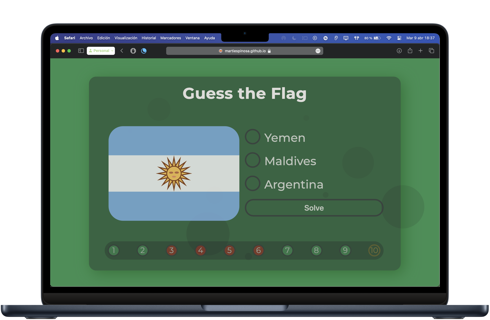

# World Flags 🌍
*A minimalist flag game built with HTML, CSS, and JavaScript.*

## About the Game
**World Flags** is a simple web game that challenges you to identify 10 random flags from around the world. Aim for a perfect 10/10 and put your knowledge to the test!  

With its **minimalist design**, **keyboard-friendly controls**, and built-in **score tracker**, the game is fast, intuitive, and keeps you motivated to improve. Think of it as a fun **flag quiz** you can play anytime.  

Play it online via **GitHub Pages** (see the repo description).

*Displayed flags are SVG images derived from the emoji flags of X (formerly known as Twitter), which I chose for their simplicity and visual appeal.*

## Keyboard Controls
| Control               | Action                    |
|-----------------------|---------------------------|
| <kbd>Tab</kbd> / <kbd>Shift</kbd> + <kbd>Tab</kbd> | Move between the answers |
| <kbd>Return</kbd>      | Confirm answer / Next flag |
| <kbd>Spacebar</kbd>    | Start / Restart game       |

## Technologies Used
- **HTML**: Structure  
- **CSS**: Styling  
- **JavaScript**: Logic & Interactivity  

## Contributing
Feel free to fork the project, create issues, or submit pull requests. Contributions are always appreciated!  
If you like this project, consider giving it a ⭐ to support it.

## License
This project is open-source and available under the [MIT License](LICENSE).
