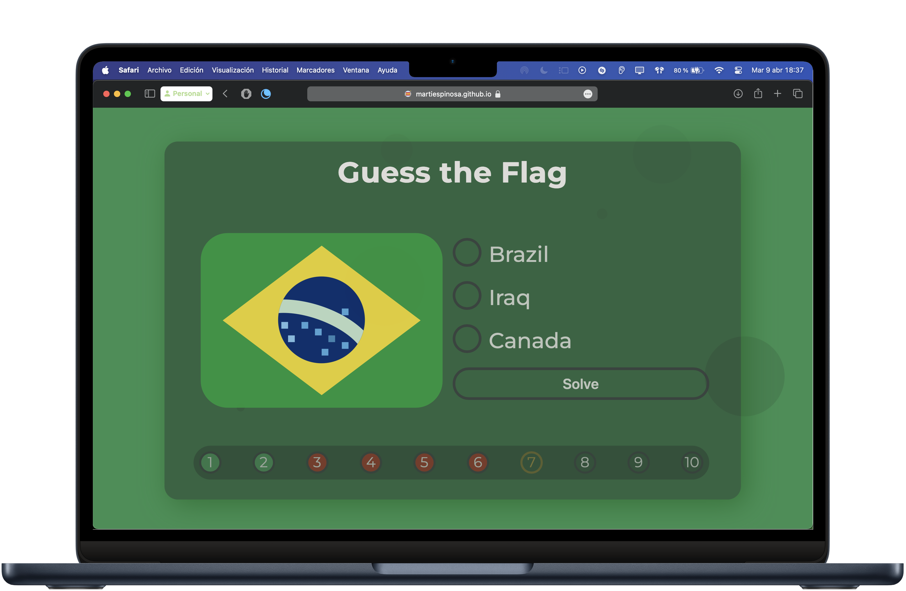

# World Flags 🌍

> **⚠️ Warning**
> 
> This project is not optimized for mobile devices. The display and user experience may not be suitable on small screens.

## About the Game
**Guess 10 Flags** is a simple and fun web game built using **vanilla HTML**, **CSS**, and **JavaScript**. In this game, you'll be shown 10 flags from around the world, and your task is to correctly identify them. Challenge yourself and aim for a perfect score of 10 out of 10!

The game features a **minimalist design** with **intuitive gameplay**, allowing you to navigate and answer quickly using keyboard controls. There’s also **score tracking** to keep track of your progress and encourage you to improve your performance.

*Displayed flags are SVG images derived from the emoji flags of X (formerly known as Twitter), which I chose for their simplicity and visual appeal.*

## Keyboard Controls
| Control               | Action                    |
|-----------------------|---------------------------|
| <kbd>Tab</kbd> / <kbd>Shift</kbd> + <kbd>Tab</kbd> | Move between the answers |
| <kbd>Return</kbd>      | Confirm answer / Next flag |
| <kbd>Spacebar</kbd>    | Start / Restart game       |

## Technologies Used
- **HTML**: Basic structure of the game.
- **CSS**: Styling and responsive design (although not optimized for mobile).
- **JavaScript**: Game logic and interactivity.

## Contributing
Feel free to fork the project, create issues, or submit pull requests. Contributions are always appreciated!

## License
This project is open-source and available under the [MIT License](LICENSE).
